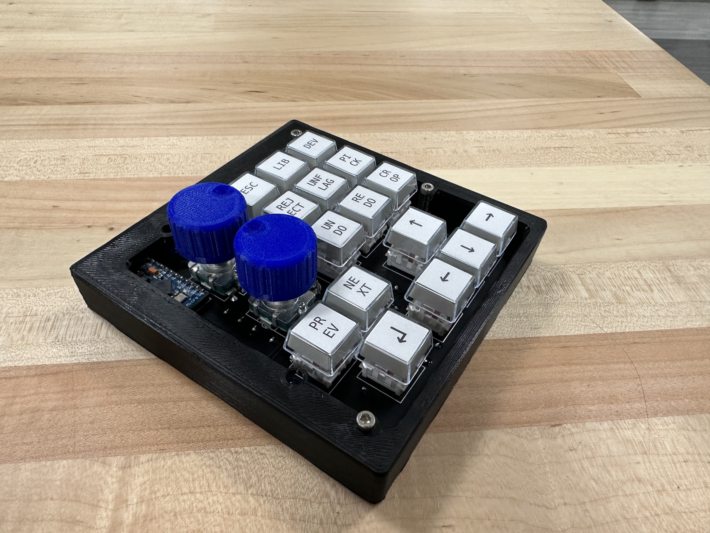
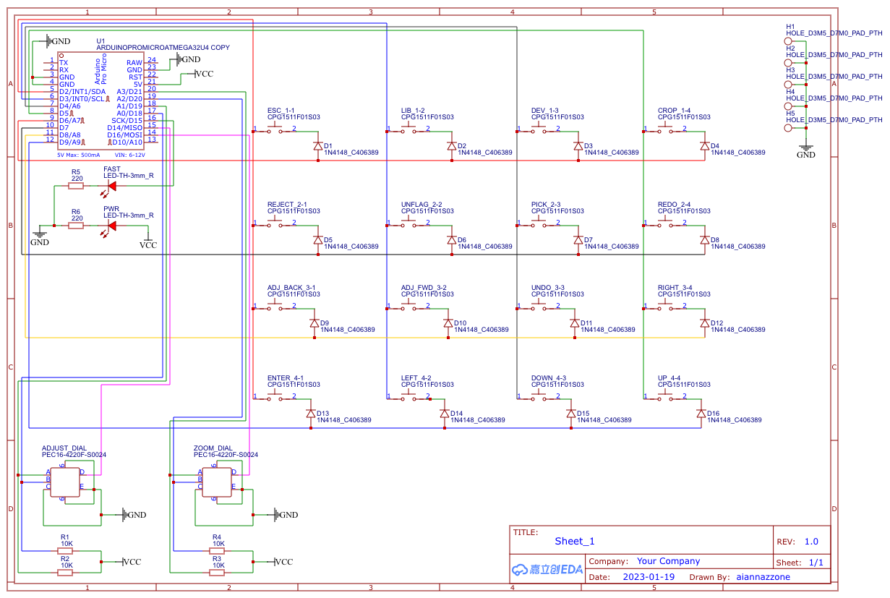
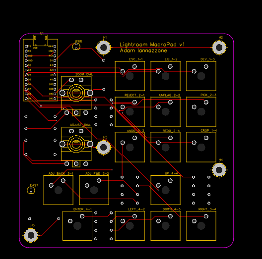

# Lightroom-Macropad (WORK IN PROGRESS)

This is an attempt to make a DIY macropad for Adobe Lightroom Classic, focusing on my most-used tools. It should work with any ATMEGA board that supports HID. I used the `ATMEGA32u4` on an Arduino Pro Micro clone, and you can find many affordable options on eBay. While the macropad is designed with Lightroom in mind, you can adapt it for any program if you're handy with the Arduino IDE.

> [Lightroom keyboard shortcuts](https://helpx.adobe.com/lightroom-classic/help/keyboard-shortcuts.html)




## Materials
All materials listed will fit in my PCB. If you use different components, I suggest printing out the PCB 1:1 and verifying that the footprints and pinouts are the same. All components are through-hole.
- Arduino Pro Micro
- [PEC16-4220F-S0024 Rotary Encoder](https://www.digikey.com/en/products/detail/bourns-inc/PEC16-4220F-S0024/3534239) (2)
  - Includes a button for toggling Zoom level and slider adjustment speed
  - If you use a different encoder, you might need to adjust the schematic and firmware (details below, also see schematic for rotary pinout)
  - **These encoders have a long-ish shaft. If I were to do this again, I would get the [same encoder with a 15mm shaft](https://www.digikey.com/en/products/detail/bourns-inc/PEC16-4215F-S0024/3534280?s=N4IgTCBcDaIAoFEDCBGAbAWgCxhQVgDEMBlABlLCxAF0BfIA).**
- MX-compatible key switches (16)
- Keycaps of your choosing (16)
  - I used the relegendable keycaps from [Adafruit](https://www.adafruit.com/product/5039) (also available on [DigiKey](https://www.digikey.com/en/products/detail/adafruit-industries-llc/5039/14313478?s=N4IgTCBcDaIEoFMA2CDmCB2ATAhgIxRAF0BfIA))
- 1N4148 diodes (16)
- 5mm LEDs (2)
- 10K-ohm resistors (4)
- 220-ohm resistors (2)

## Firmware
The [firmware](/firmware/firmware.ino) is a standard keyboard matrix (4x4), but because of the layout of the macropad, the ordering is not completely intuitive. The diagram below and included schematics should be helpful in understanding it. The encoder buttons are wired to their own dedicated pins.


If you plan to customize your macropad, please carefully read my comments in the firmware file. Since columns are actively switched through, each one gets a dedicated function for ease of understanding. You can go into each function and edit the associated shortcuts. For example:
```arduino
void firstCol(int row) {
  // Keys labeled (x, 1)
  switch (row) {
    case 0:
      Keyboard.write(KEY_ESC);
      return;
    case 1:
      Keyboard.write('x');
      return;
    case 2:
      Keyboard.write(',');
      return;
    case 3:
      Keyboard.write(KEY_RETURN);
      return;
  }
}
```
For more complicated shortcuts involving multiple key presses, you may need to use the `Keyboard.press()` method. For example, the following code is used for `UNDO`. 
```arduino
Keyboard.press(KEY_LEFT_GUI);
Keyboard.write('z');
Keyboard.releaseAll();
```
Note the use of both `Keyboard.press()` and `Keyboard.write()`. The `press` method will hold the key, while the `write` method will only activate the key once. Using `Keyboard.press('z')` for this example would result in multiple `UNDOs`.

> More information can be found on [NicoHood's repo](https://github.com/NicoHood/HID).

## PCB
The PCB was designed using [EasyEDA](https://easyeda.com). I have included their [JSON exports](/PCB/EasyEDA/) for both the schematics and PCB if you want to make changes. You can also find the live project [on EasyEDA](https://oshwlab.com/aiannazzone/lightroom).



## Enclosure
- [Base](STLs/Base.stl)
- [Open-frame lid](STLs/Lid-open.stl)
- [Fusion 360](STLs/Lightroom-Macropad-Case.f3d)
> If there is interest, I might add a more closed-off lid option.

The enclosure prints in 2 halves. You will need the following hardware:
- M3x5 (1)
- M3x16 (4)

The exact lengths aren't that important. You just want them to be long enough for the teeth to grab in the plastic pillars, but not so long that the screws protrude.

The short screw secures the PCB through the central hole directly into the bottom half of the enclosure. The 4 longer screws go through the top half, through the PCB, and into the bottom half of the enclosure. The mounting holes in the PCB are slightly oversized and allow for a little adjustment if your PCB and print don't perfectly align. 

You will also want two knobs for your rotary encoders. I have [created one](/STLs/Rotary_Knob.stl) that fits nicely on the 20mm encoders, but you can use the [parametric OpenSCAD file](/STLs/Rotary_Knob.scad) to customize it however you like.

___
<a rel="license" href="http://creativecommons.org/licenses/by-nc-sa/4.0/"></a><br />This work is licensed under a <a rel="license" href="http://creativecommons.org/licenses/by-nc-sa/4.0/">Creative Commons Attribution-NonCommercial-ShareAlike 4.0 International License</a>.