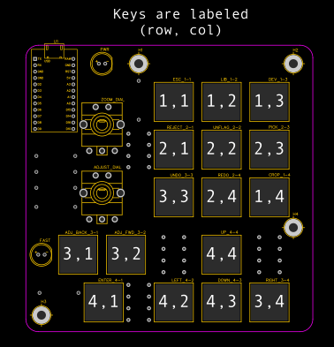

# Lightroom-Macropad (WORK IN PROGRESS)

This is an attempt to make a DIY macropad for Adobe Lightroom Classic, focusing on my most-used tools. It should work on any ATMEGA board that supports HID. I used the `ATMEGA32u4` on an Arduino Pro Micro clone. You can find many affordable options on eBay. While the macropad is designed with Lightroom in mind, you can adapt it for any program if you're handy with the Arduino IDE.

> [Lightroom keyboard shortcut reference](https://helpx.adobe.com/lightroom-classic/help/keyboard-shortcuts.html)

## Materials
All materials listed will fit in my PCB. If you use different components, I suggest printing out the PCB 1:1 and verifying that the footprints and pinouts are the same. All components are through-hole.
- Arduino Pro Micro
- [PEC16-4220F-S0024 Rotary Encoder](https://www.digikey.com/en/products/detail/bourns-inc/PEC16-4220F-S0024/3534239) (2)
  - Includes a button for toggling Zoom level and slider adjustment speeds
  - If you use a different encoder, you might need to adjust the firmware (details below)
- MX-compatible key switches (16)
- Keycaps of your choosing (16)
  - I used the relegendable keycaps from [Adafruit](https://www.adafruit.com/product/5039) (also available on [DigiKey](https://www.digikey.com/en/products/detail/adafruit-industries-llc/5039/14313478?s=N4IgTCBcDaIEoFMA2CDmCB2ATAhgIxRAF0BfIA))
- 1N4148 diodes (16)
- LEDs (2)
- 10K-ohm resistors (4)
- 220-ohm resistors (2)

## Firmware
The firmware is a standard keyboard matrix (4x4), but because of the layout of the macropad, the ordering is not completely intuitive. The diagram below and included schematics should be helpful in understanding it. The encoder buttons are wired to their own dedicated pins.

 This work is licensed under a <a rel="license" href="http://creativecommons.org/licenses/by-nc-sa/4.0/">Creative Commons Attribution-NonCommercial-ShareAlike 4.0 International License</a>.
